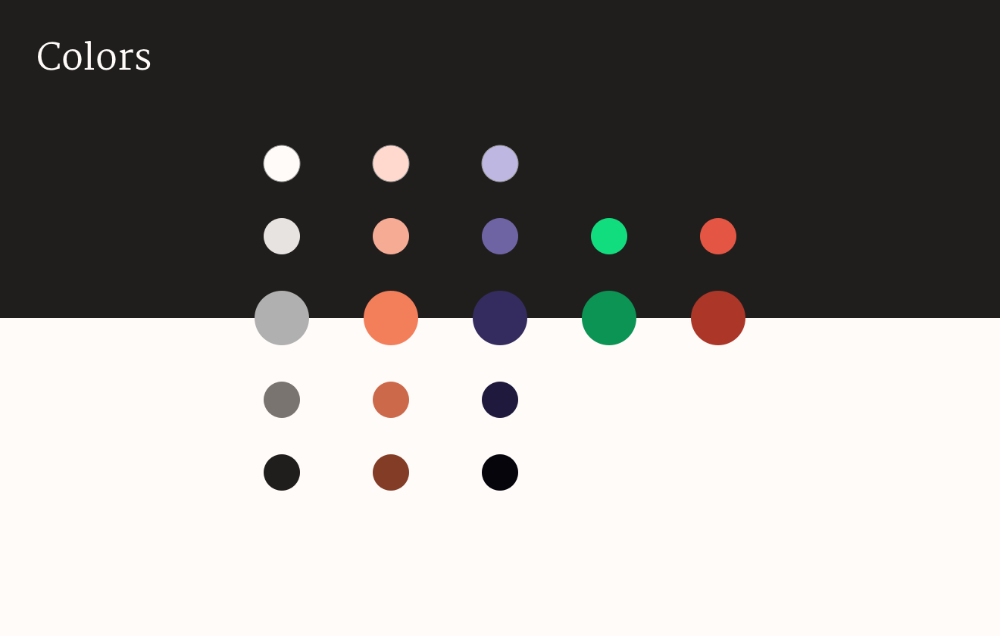
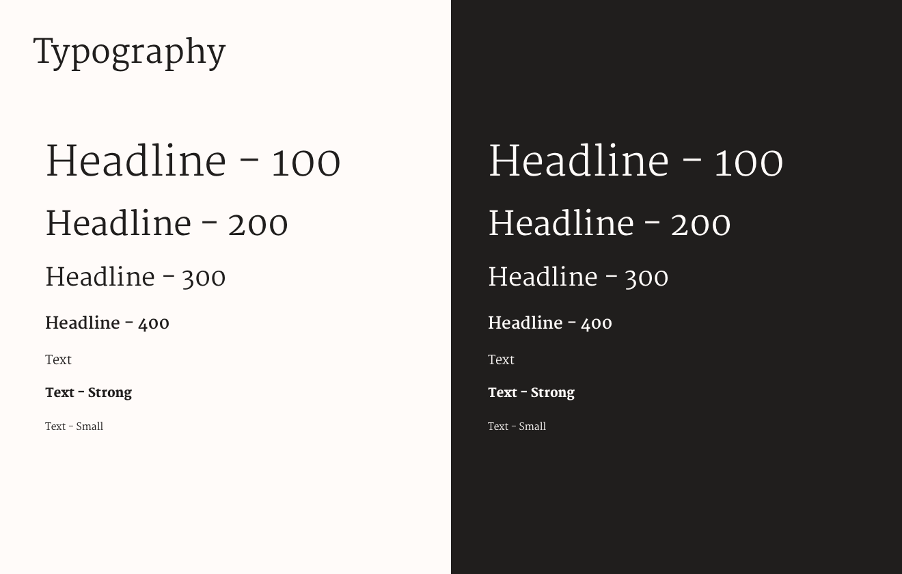
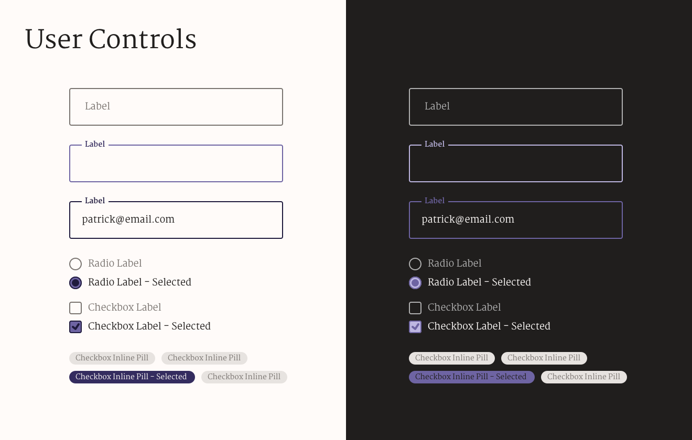

# Design System

---



### Usage

```javascript
import { colors } from "constants"

css`
  background: ${colors.purple_500};
`
```

---



### Usage

```javascript
import { Text, Headline } from "components/typography"

props => (
  <div>
    <Headline size={100}>Hello headline</Headline>
    <Text>Hello world</Text>
  </div>
)
```

---



### Usage

```javascript
import {
  Input,
  RadioGroup,
  RadioItem,
  Checkbox,
  InlineCheckbox
} from "components/controls"

props => (
  <div>
    <Input label="Email" value={this.state.value || optional} />
    <RadioGroup>
      <RadioItem value="Male" />
      <RadioItem value="Female" />
      <RadioItem value="Other" />
    </RadioGroup>
    <Checkbox value="I agree to terms and conditions" checked />
    <Checkbox
      value="I too need consent"
      checked={this.state.checked}
      onClick={this.handleCheck}
    />

    <div className="some-container">
      <InlineCheckbox
        value="Pork"
        checked={this.state.pork}
        onClick={this.handleInlineCheck}
      />
      <InlineCheckbox
        value="Beef"
        checked={this.state.beef}
        onClick={this.handleInlineCheck}
      />
      <InlineCheckbox
        value="Vegetarian"
        checked={this.state.veggie}
        onClick={this.handleInlineCheck}
      />
    </div>
  </div>
)
```
